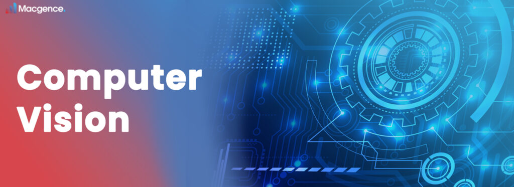

# Computer Vision Projects Collection

This repository contains a variety of computer vision projects implemented in Python. Each project demonstrates different techniques and algorithms used in the field of computer vision.

---

## Projects Included

- **Face and Eye Detection:**  
  Detect faces and eyes in images using OpenCV’s Haar Cascade classifiers.

- **Image Matching:**  
  Techniques to match and compare images based on features.

- **Digit Recognition:**  
  Recognize handwritten digits using machine learning/deep learning models.

- **Object Detection with YOLO:**  
  Real-time object detection using the YOLO (You Only Look Once) algorithm.

- **Simpsons Character Classification:**  
  Classify Simpsons characters from images using deep learning models.
  
- **Helmet Detection (YOLOv8/YOLOv11n):**
  A custom-trained YOLO model that detects safety helmets in video streams.
  The system processes video frames in real time, resizes them to 640x640, and highlights detected helmets with bounding boxes and confidence scores.

- **Video Frame Extractor with Blur Filtering:**
  Captures frames from a video or IP camera feed, filters them by sharpness using the Laplacian variance method, and saves only clear, non-blurry frames into    structured folders.
  Useful for creating clean datasets from raw videos.
---

## Requirements

Each project may have its own dependencies. Generally, you will need:

- Python 3.x  
- OpenCV (`opencv-python`)  
- NumPy (`numpy`)  
- Matplotlib (`matplotlib`)  
- Additional libraries depending on the project (e.g., TensorFlow, PyTorch, imutils)

---

## Usage

Each project is organized in its own folder with instructions inside. To run a project:

1. Navigate to the project folder.  
2. Follow the README or instructions specific to that project.  
3. Run the scripts as described.

---

## Contribution

Feel free to open issues or submit pull requests to improve existing projects or add new computer vision projects!

---

## License

This repository is open source and free to use.

---

## Contact

For questions or collaboration, please get in touch.
